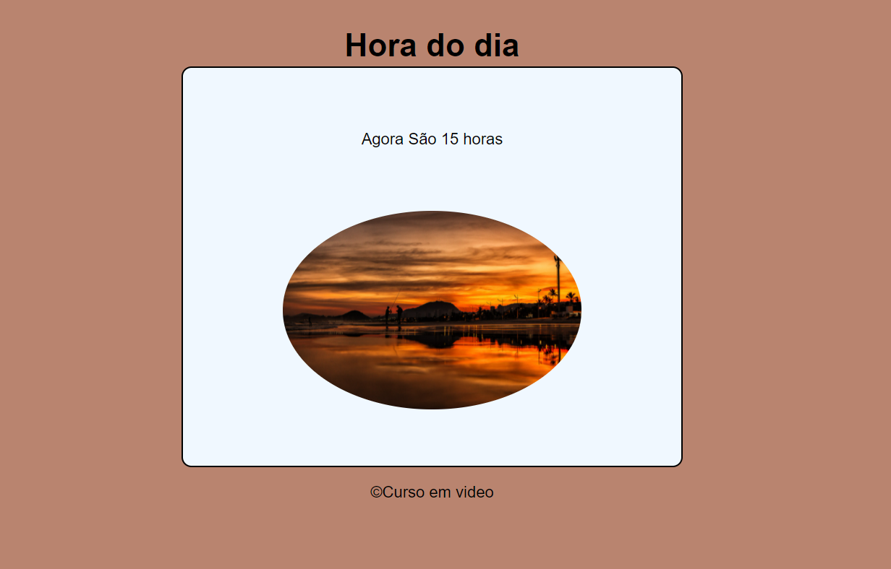
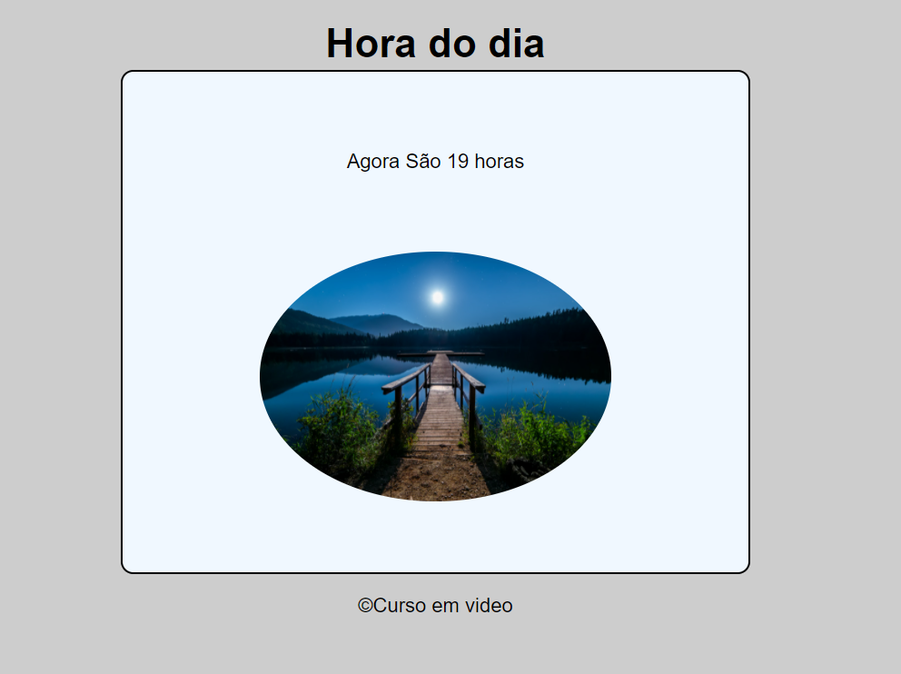
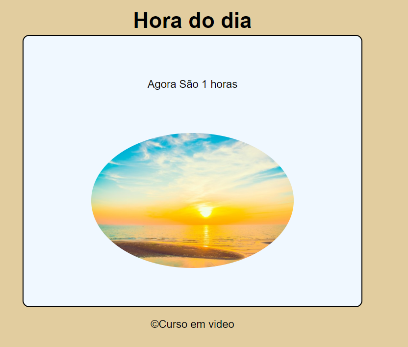

# Hora-do-Dia
Front-end simples que tem o objetivo de alterar o plano de fundo, a mensagem e a imagem de acordo com o a hora do relógio de seu computador.

Projeto desenvolvido no curso de javascript no canal do youtube:curso em video, com o professor gustavo guanabara. 
## Tecnologias Utilizadas
- HTML5 - Como linguagem de marcação
- CSS3  - Para estilização de todos os componentes.
- Javascript

## 🖥 Preview do projeto 

  
